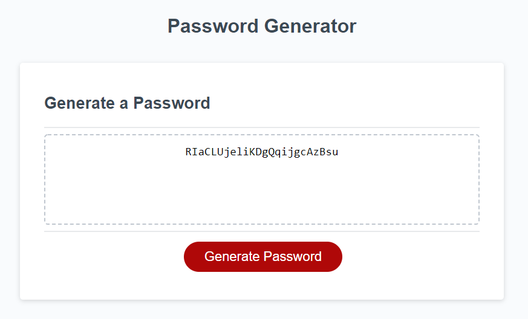

# Password-Generator
## Homework Week 3: Random Password Generator
===

## Description
This project consists of a random password generator created using javascript.  The HTML and CSS elements were provided and functionality was implemented to make the generator display a random gathering of numbers and letters based on user parameters.  Users are able to select if they would like to include uppercase letters, numbers, and symbols in addition to the default of lowercase letters.  Users are then asked to define the desired length of password, and once they press the "Generate Password' button a random string is presented in the box.

## Screenshot
Here you can find a mockup screenshot of the webpage, displaying a random string already generated in the field:

---

## URL
Web page can be located at [Gitpages](https://mrg105.github.io/Password-Generator/ "Password Generator")

## Repo
Repository can be located at [Github](https://github.com/MrG105/Password-Generator "Github")

## Contact
Javascript code and Repo updated by Gabriel Gutierrez.  [email](poo328@my.utsa.edu "email")